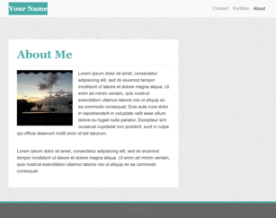
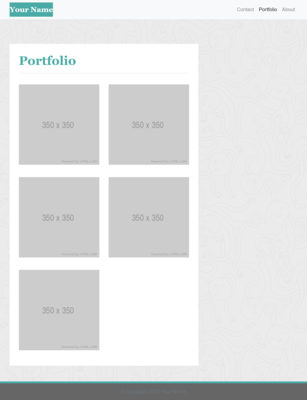
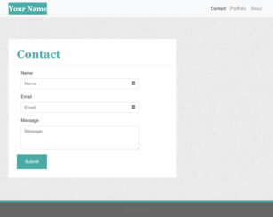

# Portfolio Demo
This is a template I have created of a portfolio webpage. It was made using bootstrap in html and references a bootstrap cdn. Processes involved creating a functional navbar to navigate between pages, using bootstrap grid system to position elements, and create a responsive webpage for different viewports. 

The goal of the template is to match the layout and features of the example images provided.

Example Images      |        My Webpage
--------------      |      --------------
|
|
|
