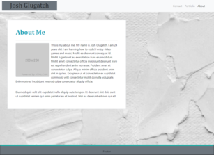
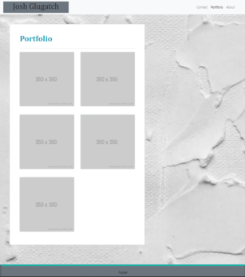
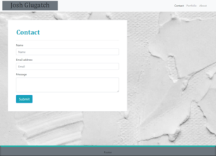

# Josh Glugatch Portfolio

This is a template I have created of a portfolio webpage. It was made using bootstrap in html and references bootstrap stylesheets. Processes involved creating a functional navbar to navigate between pages, using bootstrap grid system to position elements, and creating a responsive webpage for different viewports. 

The goal of the project is to match the layout and features of the example images provided.

Example Images      |        My Webpage
--------------      |      --------------
|
|
|

 

# Built With:
* HTML (with a special nod to Bootstrap)
* CSS (stylings within HTML and Bootsrap cdn)

 

# Deployed Link:
https://joshglugatch.github.io/portfolio-demo/

 

# Repository Link:
https://github.com/joshglugatch/portfolio-demo

 

### Author:
Josh Glugatch  
[LinkedIn](www.linkedin.com/in/joshua-glugatch)  
[GitHub](https://github.com/joshglugatch)
  
 
   

