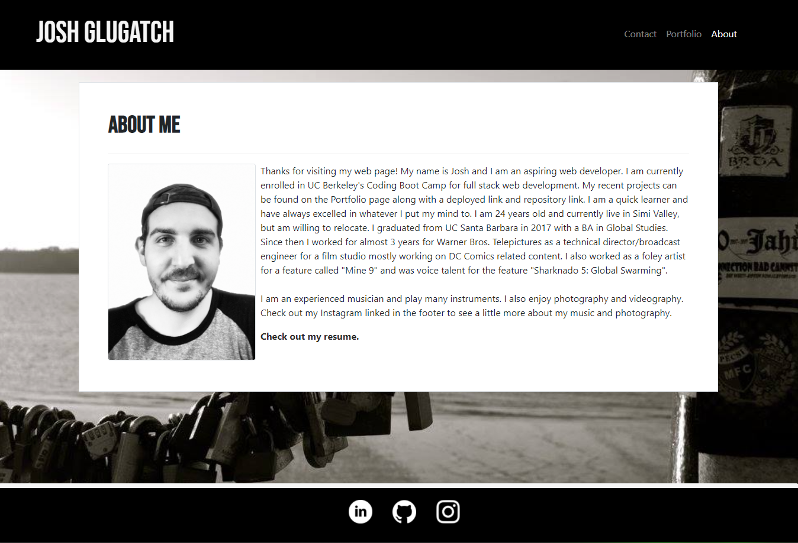
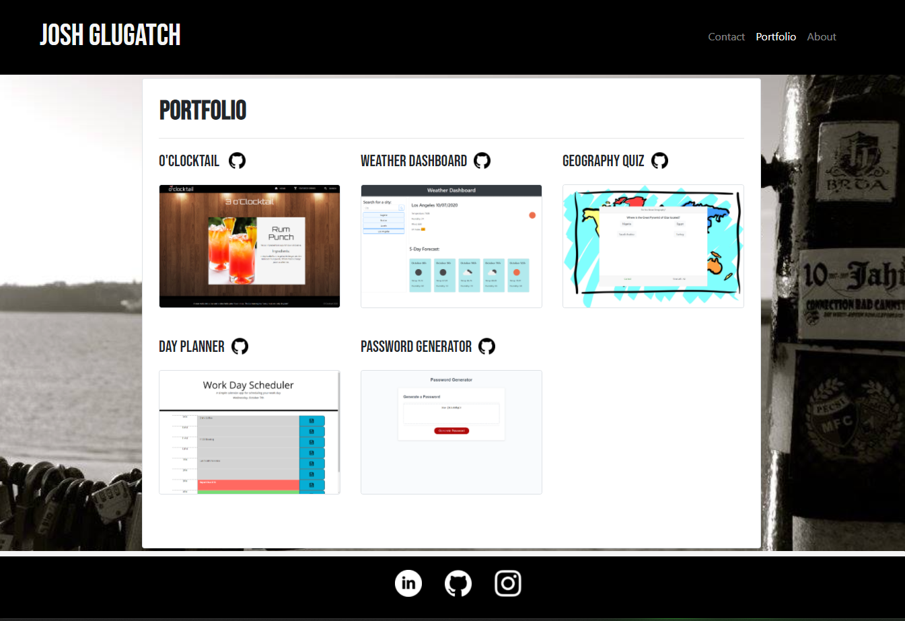
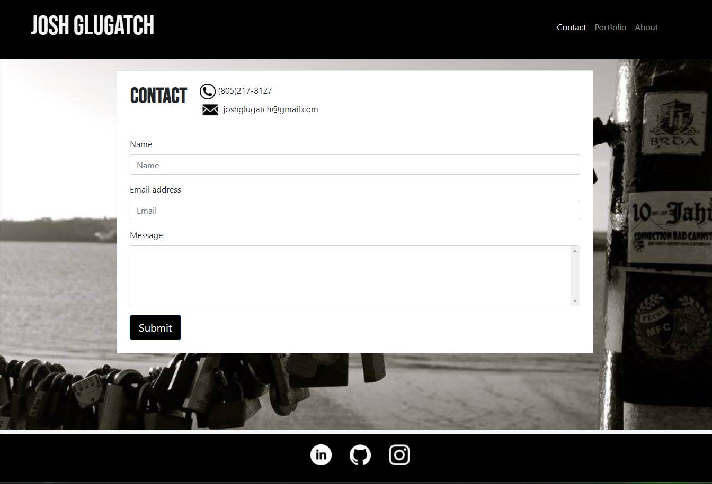

# Josh Glugatch Portfolio

Welcome to my portfolio! On my page you will find some info about me and the projects I have worked on so far. Read my About Me to get to know me, and check out the Portfolio tab to see my work. I am proud of my progress so far and I am excited to expand my coding knowledge. You will also find a contact page with my email and phone number. The page is fully responsive for mobile devices as well (but some of the projects may not be supported on mobile devices yet).

 

# Built With:
* HTML 
* CSS 
* Express

 

# Deployed Link:
https://joshglugatch.github.io/josh-glugatch-portfolio/

 

# Repository Link:
https://github.com/joshglugatch/josh-glugatch-portfolio

 

### Author:
Josh Glugatch  

 

  
 
   

